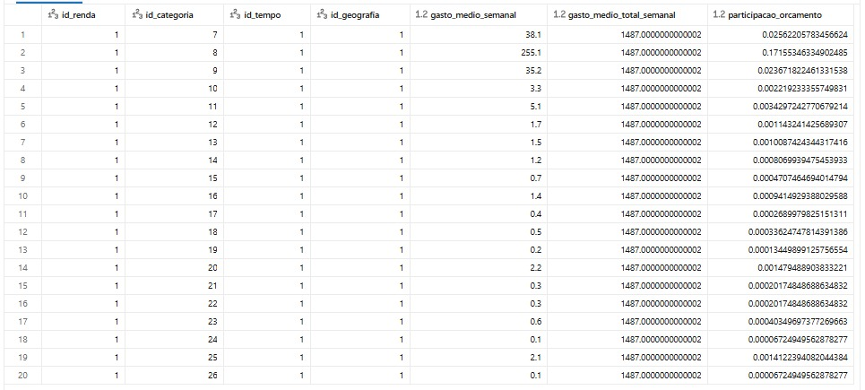
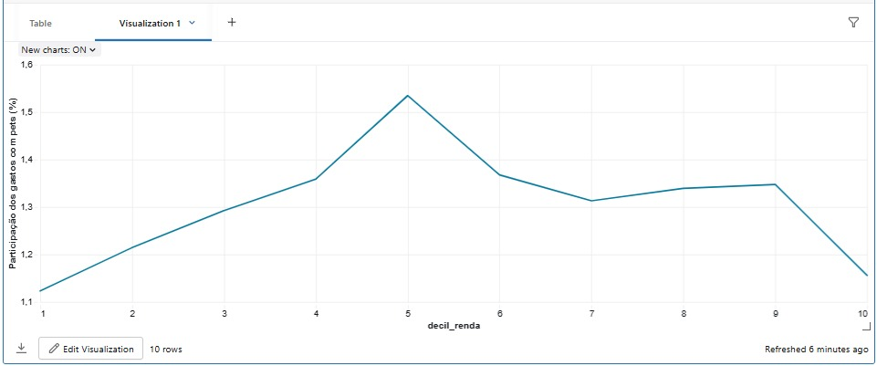

# Dados utilizados no MVP – Gastos com Pets na Cesta de Consumo

Este projeto utiliza dados oficiais de orçamento das famílias do **Reino Unido**, produzidos pelo **Office for National Statistics (ONS)**, a partir da pesquisa **Living Costs and Food Survey (LCF)**, publicados na série **Family spending**.

## Fonte principal

- **Dataset:** Family spending workbook 1: detailed expenditure and trends  
- **Órgão produtor:** Office for National Statistics (ONS) – Reino Unido  
- **Página oficial:**  
  - https://www.ons.gov.uk/peoplepopulationandcommunity/personalandhouseholdfinances/expenditure/datasets/familyspendingworkbook1detailedexpenditureandtrends  
- **Edição utilizada no MVP:**  
  - FYE 2024 (Financial Year Ending 2024) – arquivo em formato `.xlsx` disponível na página do dataset.

O workbook 1 apresenta uma **desagregação detalhada do gasto semanal médio das famílias** com diversos bens e serviços no Reino Unido.  
As informações são apresentadas por:

- **grupo de renda** (decis de renda bruta – *gross income decile group*);  
- **categoria de despesa** (alinhadas à classificação COICOP, como alimentação, habitação, transporte, lazer etc.);  
- em alguns casos, outros recortes como idade do responsável pelo domicílio.

Dentro das categorias de despesa, há linhas específicas relacionadas a **gastos com animais de estimação**, como por exemplo:

- **“Pets and pet food”**  
- em outras tabelas da mesma família de dados, podem aparecer também itens como **“Veterinary and other services for pets”**, que fazem parte do mesmo grupo de consumo.

Essas linhas são a base para a análise dos **gastos com pets** no contexto da cesta de consumo das famílias.

## Estrutura básica dos dados utilizados

Para o MVP, foi utilizada uma **versão tratada** do workbook, extraindo principalmente:

- ano / período de referência (FYE 2024);  
- grupo de renda (por decil de renda bruta);  
- categoria de despesa (descrição textual da linha, ex.: “Pets and pet food”, “Food and non-alcoholic drinks”, “Housing, fuel and power” etc.);  
- gasto médio semanal por domicílio nessa categoria (em libras);  
- gasto médio semanal total (para cálculo de participações no orçamento).

A partir desses dados brutos, foram construídas tabelas analíticas para análise de **teoria do consumidor**, em especial:

- participação dos gastos com pets no orçamento (budget share);  
- comparação com outras categorias de consumo;  
- variação dessa participação entre faixas de renda.

## Licença e uso

Conforme informado pelo ONS, o conteúdo está disponível sob a **Open Government Licence v3.0**, o que permite uso, adaptação e redistribuição, desde que haja a devida atribuição da fonte.   

Mais detalhes sobre a licença podem ser consultados em:  
https://www.nationalarchives.gov.uk/doc/open-government-licence/version/3/

Neste repositório:

- Os **arquivos brutos** em `.xlsx` **podem ou não ser versionados**, dependendo do tamanho e das orientações da disciplina.  
- Caso não sejam incluídos diretamente, este arquivo (`data/README.md`) documenta como obtê-los na fonte oficial, e os notebooks indicam o caminho esperado dos arquivos na plataforma de nuvem utilizada.

---

## Exemplos visuais

  
**Figura 1 –** Exemplo da tabela fato `fato_despesa_familiar` na camada Gold, com gasto médio semanal, gasto total do decil e participação da categoria no orçamento.

  
**Figura 2 –** Curva aproximada de Engel para gastos com pets por decil de renda (FYE 2024), com participação em torno de 1% a 1,5% do orçamento.
